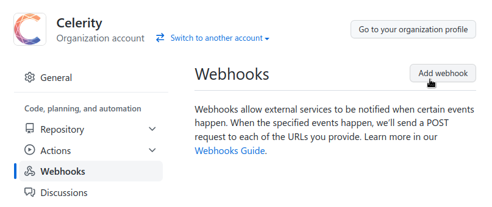
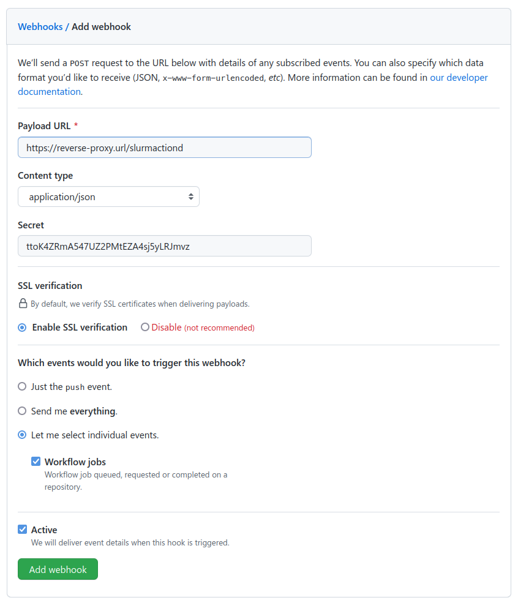
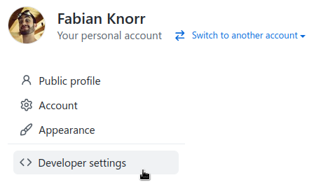
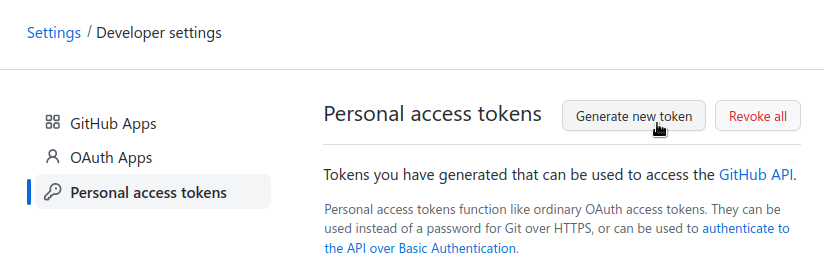
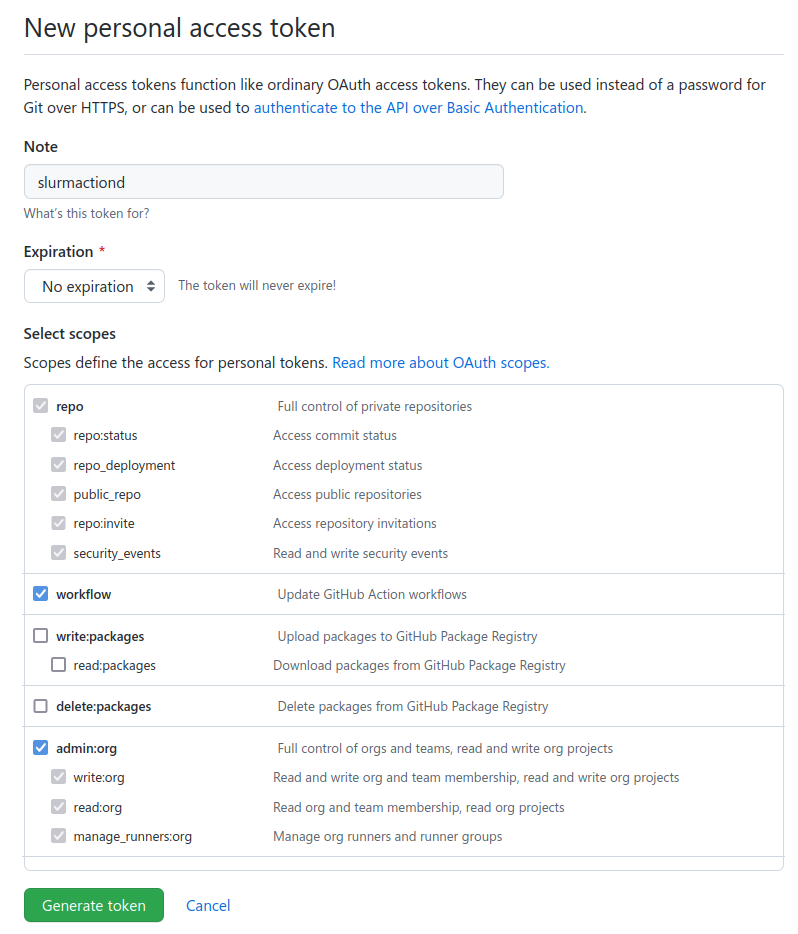

# Installation

## Configuring the Web Server

## Adding a GitHub Webhook

1. In your Repository or Organization, navigate to Settings → Webhooks and select Add Webhook.

1. Enter the reverse-proxied URL that points to slurmactiond into the Payload URL field.
2. Select `application/json` as the Content Type.
3. Generate a secure and random Webhook Secret string, and enter it in the Secret field. This will
   be used to sign messages from GitHub to slurmactiond. Keep the the secret around for when we
   enter it into the slurmactiond config file.
4. For the triggering events, manually select only "Worfklow jobs".

## Generating a Personal Access Token

1. Choose a user that slurmactiond will impersonate in order to register Actions Runners and
   navigate to its "Settings" -> "Developer Settings".

2. Select "Personal access token" -> "Generate new token".

3. Set the token to never expire.
4. Manually select the "repo" and "workflow" scopes, and if slurmactiond is supposed to manage
   runners in an organization instead of a single repository, additionally select "admin:org".

5. Save the generated access token for the slurmactiond config file.

## Installing and Configuring slurmactiond

