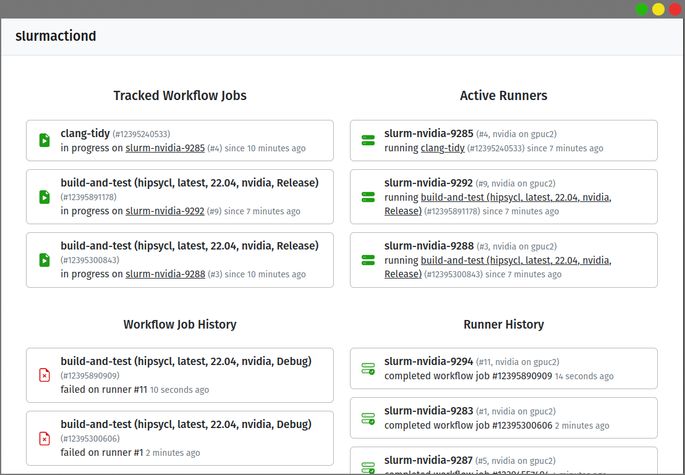

# slurmactiond

Automatically schedules ephemeral Github Actions Runners through SLURM to execute your CI jobs 
on a cluster.

slurmactiond is a Rust service receiving Github notifications through webhooks from a single
repository or an organization, and schedules Runners through local `srun` commands on the cluster
head-node it's running on.

Job and runner queues can be inspected through the built-in Web UI.

slurmactiond is used in the development of the [Celerity Runtime](https://celerity.github.io)
and is freely configurable. If it doesn't meet your use case yet, feel free to open an issue!

## Installation

See the [Installation Guide](INSTALL.md).
